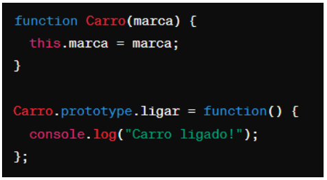
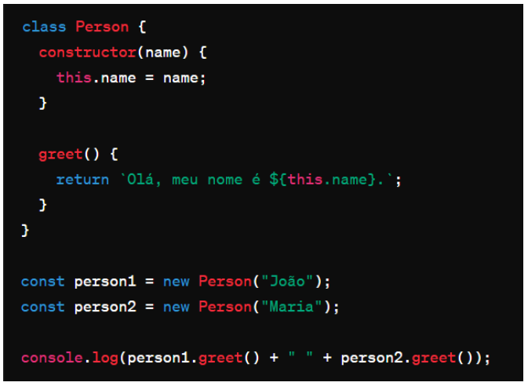

# Instruções

- Faça uma cópia deste arquivo .md para um repositório próprio
- Resolva as 6 questões objetivas assinalando a alternativa correta
- Resolva as 4 questões dissertativas escrevendo no próprio arquivo .md
  - lembre-se de utilizar as estruturas de código como ``esta aqui com ` `` ou
```javascript
//esta aqui com ```
let a = "olá"
let b = 10
print(a)
```
- Resolva as questões com uso do Visual Studio Code ou ambiente similar.
- Teste seus códigos antes de trazer a resposta para cá.
- Cuidado com ChatGPT e afins: entregar algo só para ganhar nota não faz você aprender e ficar mais inteligente. Não seja dependente da máquina!
- ao final, publique seu arquivo lista_01.md com as respostas em seu repositório, e envie o link pela Adalove. 

# Questões objetivas

**1)** O que o código a seguir faz?


Escolha a opção que responde corretamente:

a) Imprime os números pares de 1 a 10.

b) Imprime os números ímpares de 1 a 10.

<b>c) Imprime os números pares de 2 a 10.</b>

d) Imprime os números ímpares de 2 a 10.

<b>Alternativa correta: c)</b>
______

**2)** Identificar a linha que falta no código para criar uma classe Veiculo com atributo marca, e uma classe Carro que herda de Veiculo com um método ligar(). 


No lugar onde está escrito “// linha” qual das opções abaixo deve estar para funcionar corretamente o código?

<b>A) let carro = new Carro("Toyota");</b>

B) let ligar = new ligar("Toyota");

C) class Moto extends Veiculo {};

D) carro1.ligar();

<b>Alternativa correta: a)</b>

______

**3)** Qual é o valor de resultado após a execução deste código?


Escolha a opção que responde corretamente:

<b>A) 18</b>

B) 16

C) 14

D) 12

<b>Alternativa: a)</b>

______

**4)** Como você criaria um método `acelerar()` em uma classe `Carro`, que recebe um parâmetro `velocidade` e o adiciona a um atributo `velocidadeAtual`?

<b>A) </b>

B) 

C) 

D) 

<b>Alternativa: a)</b>

______

**5)** Qual a forma correta de definir uma classe Carro em JavaScript, com um método ligar() e um atributo marca?

<b>A) </b>

B) 

C) 

D) 

<b>Alternativa: a)</b>
______

**6)** Observe o código abaixo:



Qual será a saída do código acima?

<b>A) "Olá, meu nome é João. Olá, meu nome é Maria."</b>

B) "Olá, meu nome é ."

C) "João Maria"

D) "undefined undefined"

<b>Alternativa: a)</b>

______

# Questões dissertativas

**7)** Vamos criar um programa em JavaScript para entender classes, métodos e atributos!
Classe Animal:
- Crie uma classe chamada Animal.
- Adicione dois atributos: nome e idade.
- Adicione um método chamado descrever() na classe Animal.
  - Este método deve exibir no console uma descrição do animal com seu nome e idade.

Criando e manipulando Animais:
- Crie dois objetos da classe Animal: um chamado "cachorro" e outro "gato", com idades distintas.
- Para cada animal, chame o método descrever() para ver a descrição no console.

Dica: Utilize `console.log()` para exibir as informações!

```javascript
// Definição da classe Animal
class Animal {
    // Construtor que recebe nome e idade
    constructor(nome, idade) {
        this.nome = nome;
        this.idade = idade;
    }

    // Método para descrever o animal
    descrever() {
        console.log(`O animal é um ${this.nome}. Ele tem ${this.idade}.`);
    }
}

// Cria duas instâncias da classe Animal, representando um cachorro e um gato
let cachorro = new Animal("cachorro", "3 anos");
let gato = new Animal("gato", "5 meses");

// Chama o método descrever para exibir informações sobre o cachorro
cachorro.descrever();

// Chama o método descrever para exibir informações sobre o gato
gato.descrever();
```

______

**8)** Nos últimos dias tivemos a oportunidade de ter contato com Programação Orientada a Objetos, e tivemos contato com o tema "herança". Herança é um princípio de orientação a objetos, que permite que classes compartilhem atributos e métodos. Ela é usada na intenção de reaproveitar código ou comportamento generalizado ou especializar operações ou atributos. Então vamos praticar esse conteúdo nessa questão.
Vamos criar um programa em JavaScript para entender classes, métodos, atributos e herança!

Classe Animal:
- Crie uma classe chamada Animal.
- Adicione dois atributos: nome e idade.
- Adicione um método descrever() que exiba no console uma descrição do animal com seu nome e idade.

Classe Gato (Herda de Animal):
- Crie uma classe chamada Gato que herda da classe Animal.
- Adicione um atributo extra cor específico para gatos.
- Adicione um método miar() que exiba no console o som que um gato faz.

Criando Animais:
- Crie dois objetos da classe Animal: um chamado cachorro e outro gato, com idades distintas.
- Para o gato, também defina a cor.

Chamando os Métodos:
- Para cada animal, chame o método descrever() para ver a descrição no console.
- Para o gato, chame o método miar() para "ouvir" o som que ele faz (é também para ver o som no console).

Dica: Utilize console.log() para exibir as informações!
```javascript
// Definição da classe Animal
class Animal {
    // Construtor que recebe nome e idade
    constructor(nome, idade) {
        this.nome = nome;
        this.idade = idade;
    }

    // Método para descrever o animal
    descrever() {
        console.log(`O animal é um ${this.nome}. Ele tem ${this.idade} anos.`);
    }
}

// Definição da classe Gato, que herda de Animal
class Gato extends Animal {

    tipo = "gato"; // Em vez do parâmetro dizer respeito ao tipo de animal, agora se adiciona uma padrão para todos os animais que são gatos

    // Construtor que recebe nome (apelido), idade e cor
    constructor(nome, idade, cor) {
        // Chama o construtor da classe pai (Animal)
        super(nome, idade);

        // Atribui propriedades específicas da classe Gato
        this.cor = cor;
        
    }

    // Sobrescreve o método descrever para incluir informações específicas do Gato
    descrever() {
        console.log(`O animal é um ${this.tipo}. Seu nome é ${this.nome} e ele tem ${this.idade}. Seu pelo é ${this.cor} :)` + `\n`);
    }

    // Método específico para gatos, fazendo o gato miar
    miar() {
        console.log("Miauuuu");
    }
}

// Cria uma instância da classe Gato
let gato = new Gato("Geraldinho", "5 meses", "preto");

// Chama o método para descrever as informações do gato
gato.descrever();

// Chama o método específico para gatos, fazendo o gato miar
gato.miar();
```
______

**9)** Vamos criar um programa em JavaScript para somar notas!

Classe SomadorDeNotas:
- Crie uma classe chamada SomadorDeNotas.
- Adicione um atributo total inicializado com 0 para armazenar a soma das notas.

Método adicionarNota:
- Adicione um método chamado adicionarNota(nota) na classe SomadorDeNotas.
- Este método deve receber um parâmetro nota e somá-lo ao atributo total.

Criando o Somador e Adicionando Notas:
- Crie um objeto da classe SomadorDeNotas, chamado somador.
- Utilize o método adicionarNota(nota) para adicionar algumas notas ao somador.

Chamando o Método para Ver o Total:
- Após adicionar todas as notas, chame um método verTotal() para exibir o total das notas adicionadas.

Dica: Utilize console.log() para exibir as informações!

```javascript
// Definição da classe SomadorDeNotas
class SomadorDeNotas {
    // Inicializa a propriedade total com 0
    total = 0;

    // Método para adicionar uma nota ao total
    adicionarNota(nota) {
        this.total += nota;
    }

    // Método para exibir o total de notas, formatando-o para uma casa decimal
    verTotal() {
        // Formata o total para uma casa decimal
        this.total = this.total.toFixed(1);

        // Exibe o total formatado
        console.log(`O total de notas é: ${this.total}`);
    }
}

// Cria uma instância da classe SomadorDeNotas
let somador = new SomadorDeNotas();

// Adiciona algumas notas à instância do somador
somador.adicionarNota(9.85);
somador.adicionarNota(8.14);
somador.adicionarNota(7.15);

// Exibe o total acumulado das notas
somador.verTotal();
```
______

**10)** Imagine que você está criando um programa em JavaScript para uma escola. Neste programa, existem diferentes tipos de funcionários, cada um com suas próprias características. Considere as seguintes classes:

Funcionário:
- atributo: Nome
- atributo: Idade
- atributo: Salário base
- método: calcularSalario() - Este método calcula o salário total do funcionário. Para cada tipo de funcionário, o cálculo será diferente.

Professor (herança de Funcionário):
- atributo: Disciplina
- atributo: Horas de aula por semana
- método: calcularSalario() - Para calcular o salário do professor, multiplicamos suas horas de aula pelo valor da hora/aula.

Agora, sua tarefa é escrever um código em JavaScript que crie as classes Funcionário e Professor, com suas características e métodos descritos acima. Depois de criar as classes, crie:
- Dois objetos do tipo Professor com informações fictícias.
- Para cada objeto, chame o método calcularSalario() e mostre o salário calculado no console.

Certifique-se de explicar cada parte do código utilizando comentários, explicando para que serve cada atributo e método, bem como a lógica por trás do cálculo de salário para o tipo de funcionário Professor.

```javascript
// Definição da classe base Funcionario
class Funcionario {
    // Construtor que recebe nome e idade como parâmetros
    constructor(nome, idade){
        this.nome = nome;
        this.idade = idade;
    }

    // Método para calcular o salário (será implementado nas subclasse Professor)
    calcularSalario(){
    }

    // Método para descrever as informações do funcionário
    descrever() {
        console.log(`O funcionário ${this.nome} tem ${this.idade} anos e o seu salário base é de ${this.salarioBase}`);
    }
}

// Definição da classe Professor, que herda da classe Funcionario
class Professor extends Funcionario {

    // Construtor que recebe nome, idade, disciplina, horasAula e valorHorasAula como parâmetros
    constructor(nome, idade, disciplina, horasAula, valorHorasAula) {
        // Chama o construtor da classe pai (Funcionario)
        super(nome, idade);

        // Atribui as propriedades específicas da classe Professor
        this.disciplina = disciplina;
        this.horasAula = horasAula;
        this.valorHorasAula = valorHorasAula; //Váriavel criada pelo desenvolvedor para propor uma forma de calcular o salário base
    }

    // Implementação do método para calcular o salário específico para professores
    calcularSalario(){
        //calcula o salário base conforme os parâmetros colocados
        this.salarioBase = this.horasAula * this.valorHorasAula;
    }

    // Sobrescreve o método descrever da classe pai para incluir informações específicas do Professor
    descrever() {
        console.log(`${this.nome} de ${this.disciplina} tem ${this.idade} anos e o seu salário base é de R$ ${this.salarioBase}, já que ele trabalha ${this.horasAula} horas por mês e ganha R$ ${this.valorHorasAula} por hora-aula.`);
    }
}

// Cria uma instância da classe Professor com os parâmetros pedidos
let minerva = new Professor("Minerva McGonagall", "96", "Transfiguração", "160", "150");

// Chama o método para calcular o salário
minerva.calcularSalario();

// Chama o método para descrever as informações do professor
minerva.descrever();
```
